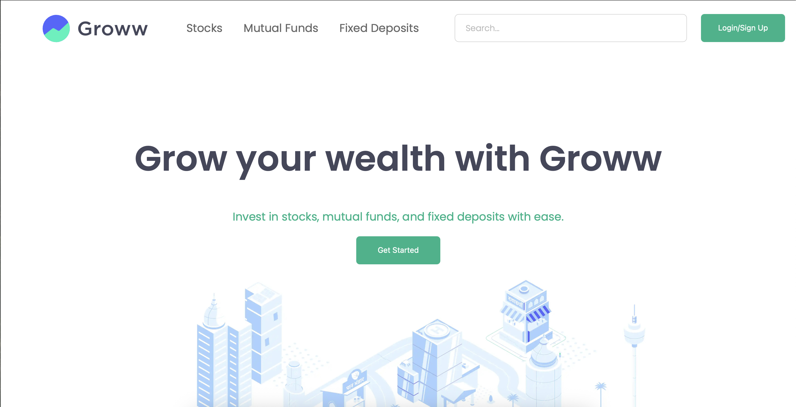
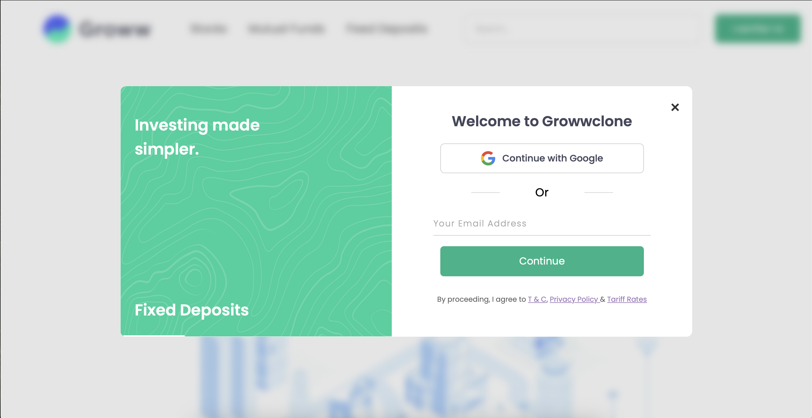

# 💹 Growvest – Fullstack Groww Clone

Growvest is a fullstack clone of the Groww platform aimed at simulating a seamless and secure experience for users to explore and invest in financial products like stocks, mutual funds, and fixed deposits.

---

## 🎯 Project Goal

To build a fullstack application that mimics the functionality and user experience of the Groww app, including:

- Responsive frontend UI
- OTP-based authentication
- Secure user verification
- Dashboard for personalized features
- Real data integration (coming soon)

---

## ✅ Features Completed So Far

### 🔐 OTP Authentication Flow
- Email input + validation (frontend)
- OTP generation (6-digit) via Nodemailer
- OTP delivery through Gmail SMTP
- OTP stored in MongoDB with 5-minute expiry
- Secure verification with `/verify-otp` route
- Animated UI transitions between screens

### 🖼️ Preview

#### ✅ Homepage Screen


#### 🔐 OTP Authentication Screen


### 💻 Tech Stack

| Layer        | Tech Used                       |
|--------------|----------------------------------|
| **Frontend** | HTML, CSS, JavaScript           |
| **Backend**  | Node.js, Express.js             |
| **Database** | MongoDB, Mongoose               |
| **Email**    | Nodemailer (Gmail SMTP)         |
| **Tools**    | Thunder Client, Live Server, Git |

---

## 🛠 Upcoming Features

- [ ] Resend OTP feature with cooldown timer
- [ ] Store verified users in a `users` collection
- [ ] JWT-based login session with secure routes
- [ ] Full dashboard with stock cards, watchlist, and user profile
- [ ] Integration with live stock APIs (optional)

---

## 🚀 How to Run

1. Clone this repo:
   ```bash
   git clone https://github.com/your-username/growvest.git
   ```

2. Setup backend:
   ```bash
   cd authfiles
   npm install
   npm run dev
   ```

3. Open `index.html` using Live Server (VS Code recommended)

4. Set your `.env`:
   ```
   EMAIL_USER=your-email@gmail.com
   EMAIL_PASS=your-app-password
   MONGO_URI=your-mongodb-uri
   ```

---

## 🤝 Contributions

This is a learning-focused solo project. Feedback and ideas are welcome!

---

## 📧 Author

**Harsh Mandlik**  
GitHub: [@Mharsh09](https://github.com/Mharsh09)